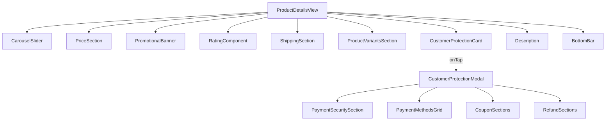
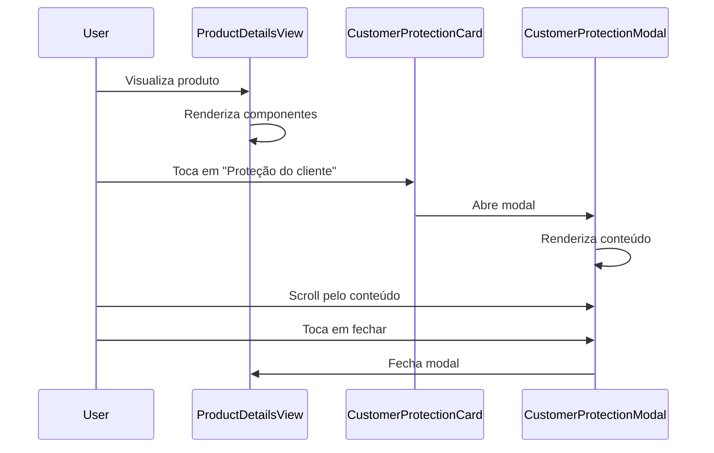

# Design Document - Product Details Page

## Overview

Este documento descreve o design técnico para implementar a tela de detalhes do produto no EShop, seguindo o padrão visual moderno de e-commerce (similar ao TikTok Shop/Shopee). A implementação seguirá Clean Architecture e utilizará componentes reutilizáveis.

## Architecture

### Camadas

```
presentation/
├── views/
│   └── product/
│       └── product_details_view.dart (refatoração)
├── widgets/
│   ├── product/
│   │   ├── price_section.dart (novo)
│   │   ├── promotional_banner.dart (novo)
│   │   ├── rating_component.dart (novo)
│   │   ├── shipping_section.dart (novo)
│   │   ├── product_variants_section.dart (novo)
│   │   └── customer_protection_card.dart (novo)
│   └── modals/
│       └── customer_protection_modal.dart (novo)
domain/
├── entities/
│   └── product/
│       ├── product.dart (existente - adicionar campos)
│       ├── price_tag.dart (existente - adicionar campos)
│       ├── shipping_info.dart (novo)
│       ├── promotion.dart (novo)
│       └── customer_protection.dart (novo)
```

---

## Components and Interfaces

### 1. Price Section Component

**Responsabilidade:** Exibir preço, desconto e parcelamento

**Widget:** `PriceSection`

```dart
class PriceSection extends StatelessWidget {
  final num currentPrice;
  final num? originalPrice;
  final int? discountPercentage;
  final InstallmentInfo? installment;
  
  const PriceSection({
    required this.currentPrice,
    this.originalPrice,
    this.discountPercentage,
    this.installment,
  });
}
```

**Layout:**
- Row principal com badge de desconto + preços
- Row secundária com ícone de cartão + parcelamento
- Cores: vermelho/rosa para destaque

---

### 2. Promotional Banner Component

**Responsabilidade:** Exibir promoções especiais

**Widget:** `PromotionalBanner`

```dart
class PromotionalBanner extends StatelessWidget {
  final Promotion promotion;
  final VoidCallback onTap;
  
  const PromotionalBanner({
    required this.promotion,
    required this.onTap,
  });
}
```


**Layout:**
- Container com fundo rosa claro
- Ícone de presente + texto + seta
- Padding: 12px vertical, 16px horizontal
- Border radius: 8px

---

### 3. Rating Component

**Responsabilidade:** Exibir avaliação e vendas

**Widget:** `RatingComponent`

```dart
class RatingComponent extends StatelessWidget {
  final double rating;
  final int reviewCount;
  final int soldCount;
  
  const RatingComponent({
    required this.rating,
    required this.reviewCount,
    required this.soldCount,
  });
}
```

**Layout:**
- Row com: estrela + nota + (reviews) + | + vendidos
- Cores: amarelo para estrela, cinza para texto
- Font size: 14sp

---

### 4. Shipping Section Component

**Responsabilidade:** Exibir informações de frete

**Widget:** `ShippingSection`

```dart
class ShippingSection extends StatelessWidget {
  final ShippingInfo shippingInfo;
  final VoidCallback onTap;
  
  const ShippingSection({
    required this.shippingInfo,
    required this.onTap,
  });
}
```

**Layout:**
- Container com fundo branco
- Row: ícone caminhão + conteúdo + seta
- Badge "Frete grátis" se aplicável
- Prazo de entrega + taxa (riscada se grátis)
- Border radius: 8px

---

### 5. Product Variants Section Component

**Responsabilidade:** Exibir variações do produto

**Widget:** `ProductVariantsSection`

```dart
class ProductVariantsSection extends StatelessWidget {
  final List<PriceTag> variants;
  final VoidCallback onTap;
  
  const ProductVariantsSection({
    required this.variants,
    required this.onTap,
  });
}
```

**Layout:**
- Container com fundo branco
- Row: ícone grid + miniaturas + texto + seta
- Mostrar primeiras 2-3 variações
- Border radius: 8px

---

### 6. Customer Protection Card Component

**Responsabilidade:** Exibir resumo das proteções

**Widget:** `CustomerProtectionCard`

```dart
class CustomerProtectionCard extends StatelessWidget {
  final VoidCallback onTap;
  
  const CustomerProtectionCard({
    required this.onTap,
  });
}
```

**Layout:**
- Container com fundo bege/creme
- Header: ícone escudo + título + seta
- Grid 2x2 com 4 benefícios
- Cada benefício: check verde + texto
- Border radius: 8px
- Padding: 16px

---

### 7. Customer Protection Modal

**Responsabilidade:** Exibir detalhes completos das proteções

**Widget:** `CustomerProtectionModal`

```dart
class CustomerProtectionModal extends StatelessWidget {
  const CustomerProtectionModal();
  
  static Future<void> show(BuildContext context) {
    return showModalBottomSheet(
      context: context,
      isScrollControlled: true,
      backgroundColor: Colors.transparent,
      builder: (context) => const CustomerProtectionModal(),
    );
  }
}
```

**Layout:**
- Container com fundo branco
- Border radius superior: 16px
- Header: título + botão fechar
- Scrollable content:
  - Seção pagamento seguro
  - Grid de logos de pagamento
  - Certificações
  - Cupons (3 tipos)
  - Reembolsos (2 tipos)
- Max height: 90% da tela

---

## Data Models

### ShippingInfo Entity

```dart
class ShippingInfo extends Equatable {
  final bool isFree;
  final num shippingCost;
  final DateTime estimatedDeliveryStart;
  final DateTime estimatedDeliveryEnd;
  
  const ShippingInfo({
    required this.isFree,
    required this.shippingCost,
    required this.estimatedDeliveryStart,
    required this.estimatedDeliveryEnd,
  });
  
  String get deliveryRange {
    final start = DateFormat('dd').format(estimatedDeliveryStart);
    final end = DateFormat('dd').format(estimatedDeliveryEnd);
    final month = DateFormat('MMM', 'pt_BR').format(estimatedDeliveryEnd);
    return 'Receba até $start-$end de $month';
  }
  
  @override
  List<Object?> get props => [
    isFree,
    shippingCost,
    estimatedDeliveryStart,
    estimatedDeliveryEnd,
  ];
}
```

### Promotion Entity

```dart
class Promotion extends Equatable {
  final String id;
  final String title;
  final String description;
  final num minPurchase;
  final num discount;
  
  const Promotion({
    required this.id,
    required this.title,
    required this.description,
    required this.minPurchase,
    required this.discount,
  });
  
  @override
  List<Object?> get props => [id, title, description, minPurchase, discount];
}
```

### InstallmentInfo

```dart
class InstallmentInfo {
  final int installments;
  final num installmentValue;
  
  const InstallmentInfo({
    required this.installments,
    required this.installmentValue,
  });
  
  String get displayText => '${installments}x R\$ ${installmentValue.toStringAsFixed(2)}';
}
```

### Extensões para Product Entity

```dart
// Adicionar ao Product existente:
class Product extends Equatable {
  // ... campos existentes ...
  
  // Novos campos:
  final num? originalPrice;
  final int? discountPercentage;
  final double rating;
  final int reviewCount;
  final int soldCount;
  final ShippingInfo? shippingInfo;
  final Promotion? activePromotion;
  
  // Computed properties:
  num get currentPrice => priceTags.first.price;
  
  InstallmentInfo? get installmentInfo {
    if (currentPrice >= 50) {
      return InstallmentInfo(
        installments: 5,
        installmentValue: currentPrice / 5,
      );
    }
    return null;
  }
}
```

---

## Error Handling

### Cenários de Erro

1. **Imagens não carregam**
   - Mostrar placeholder cinza
   - Ícone de erro se falhar completamente

2. **Dados incompletos**
   - Ocultar seções opcionais se dados não disponíveis
   - Mostrar valores padrão para campos obrigatórios

3. **Modal não abre**
   - Log de erro
   - Mostrar snackbar informativa

### Implementação

```dart
class ErrorHandler {
  static void handleImageError(String productId, String imageUrl) {
    debugPrint('Failed to load image: $imageUrl for product: $productId');
  }
  
  static void handleModalError(BuildContext context, dynamic error) {
    ScaffoldMessenger.of(context).showSnackBar(
      const SnackBar(
        content: Text('Não foi possível abrir os detalhes'),
        duration: Duration(seconds: 2),
      ),
    );
  }
}
```

---

## Testing Strategy

### Unit Tests

1. **Data Models**
   - Testar computed properties (deliveryRange, displayText)
   - Testar equality (Equatable)

2. **Business Logic**
   - Calcular parcelamento corretamente
   - Formatar preços corretamente
   - Calcular desconto corretamente

### Widget Tests

1. **Price Section**
   - Exibir badge de desconto quando aplicável
   - Exibir preço original riscado
   - Exibir parcelamento quando disponível

2. **Rating Component**
   - Exibir estrela e nota
   - Formatar número de reviews
   - Formatar número de vendas

3. **Shipping Section**
   - Exibir badge "Frete grátis"
   - Riscar taxa quando grátis
   - Formatar prazo corretamente

4. **Customer Protection Card**
   - Exibir 4 benefícios
   - Responder a toque

5. **Customer Protection Modal**
   - Abrir e fechar corretamente
   - Scroll funcionar
   - Exibir todas as seções

### Integration Tests

1. **Fluxo completo**
   - Navegar para detalhes do produto
   - Visualizar todas as seções
   - Abrir modal de proteção
   - Fechar modal
   - Adicionar ao carrinho

---

## Performance Considerations

### Otimizações

1. **Imagens**
   - Usar CachedNetworkImage (já implementado)
   - Lazy loading para imagens do carrossel
   - Comprimir imagens no backend

2. **Widgets**
   - RepaintBoundary em componentes estáticos
   - const constructors onde possível
   - Evitar rebuilds desnecessários

3. **Modal**
   - Lazy loading do conteúdo
   - Cache de logos de pagamento
   - Animações otimizadas (60 FPS)

### Implementação

```dart
class OptimizedPriceSection extends StatelessWidget {
  // ... props ...
  
  @override
  Widget build(BuildContext context) {
    return RepaintBoundary(
      child: Container(
        // ... layout ...
      ),
    );
  }
}
```

---

## Accessibility

### Implementação

1. **Semantics**
```dart
Semantics(
  label: 'Preço: R\$ ${currentPrice.toStringAsFixed(2)}',
  child: Text('R\$ $currentPrice'),
)
```

2. **Contraste**
- Texto preto em fundo branco: 21:1 ✅
- Texto branco em fundo rosa: 4.5:1 ✅
- Texto marrom em fundo bege: 4.8:1 ✅

3. **Áreas de Toque**
- Mínimo 48x48dp para todos os botões
- Padding adequado em cards clicáveis

---

## Theme Integration

### Cores

```dart
class ProductDetailsTheme {
  static const Color discountBadge = Color(0xFFFF4D67);
  static const Color priceHighlight = Color(0xFFFF4D67);
  static const Color freeShippingBadge = Color(0xFF00C853);
  static const Color protectionBackground = Color(0xFFFFF8E1);
  static const Color protectionIcon = Color(0xFFD4AF37);
  static const Color protectionText = Color(0xFF8B4513);
}
```

### Typography

```dart
class ProductDetailsTypography {
  static const TextStyle priceMain = TextStyle(
    fontSize: 32,
    fontWeight: FontWeight.bold,
    color: ProductDetailsTheme.priceHighlight,
  );
  
  static const TextStyle priceOriginal = TextStyle(
    fontSize: 18,
    decoration: TextDecoration.lineThrough,
    color: Colors.grey,
  );
  
  static const TextStyle productTitle = TextStyle(
    fontSize: 22,
    fontWeight: FontWeight.w500,
    color: Colors.black87,
  );
}
```

---

## Animation Specifications

### Modal Animation

```dart
class ModalAnimation {
  static const Duration duration = Duration(milliseconds: 300);
  static const Curve curve = Curves.easeInOut;
  
  static Widget buildTransition(
    BuildContext context,
    Animation<double> animation,
    Widget child,
  ) {
    return SlideTransition(
      position: Tween<Offset>(
        begin: const Offset(0, 1),
        end: Offset.zero,
      ).animate(CurvedAnimation(
        parent: animation,
        curve: curve,
      )),
      child: child,
    );
  }
}
```

### Ripple Effect

```dart
InkWell(
  onTap: onTap,
  borderRadius: BorderRadius.circular(8),
  child: // ... content ...
)
```

---

## Implementation Notes

### Ordem de Implementação

1. **Fase 1: Data Models**
   - Criar ShippingInfo
   - Criar Promotion
   - Criar InstallmentInfo
   - Estender Product

2. **Fase 2: Componentes Básicos**
   - PriceSection
   - RatingComponent
   - PromotionalBanner

3. **Fase 3: Componentes Avançados**
   - ShippingSection
   - ProductVariantsSection
   - CustomerProtectionCard

4. **Fase 4: Modal**
   - CustomerProtectionModal
   - Seções internas do modal

5. **Fase 5: Integração**
   - Refatorar ProductDetailsView
   - Integrar todos os componentes
   - Testes

### Dependências Necessárias

```yaml
dependencies:
  intl: ^0.18.0 # Para formatação de datas
  # Já existentes:
  # cached_network_image
  # carousel_slider
  # smooth_page_indicator
```

---

## White Label Considerations

### Configurações Customizáveis

```dart
class CustomerProtectionConfig {
  final bool showProtectionCard;
  final num couponValue;
  final List<String> paymentMethods;
  final String privacyPolicyUrl;
  
  const CustomerProtectionConfig({
    this.showProtectionCard = true,
    this.couponValue = 25.00,
    this.paymentMethods = const [
      'mastercard',
      'visa',
      'elo',
      'amex',
      'maestro',
      'boleto',
      'pix',
      'gpay',
    ],
    required this.privacyPolicyUrl,
  });
}
```

### Uso

```dart
// Em ThemeConfig
final customerProtection = CustomerProtectionConfig(
  privacyPolicyUrl: 'https://cliente.com/privacidade',
  couponValue: 30.00, // Cliente pode customizar
);
```

---

## Mermaid Diagrams

### Component Hierarchy



### Data Flow



---

## Conclusion

Este design fornece uma base sólida para implementar a tela de detalhes do produto com todos os recursos modernos de e-commerce. A arquitetura modular permite fácil manutenção e extensão, enquanto as considerações de performance e acessibilidade garantem uma ótima experiência do usuário.

**Próximos Passos:**
1. Revisar e aprovar este design
2. Criar task list detalhado
3. Implementar fase por fase
4. Testar cada componente
5. Integrar e testar fluxo completo

---

**Última atualização:** 13 de Novembro de 2025
